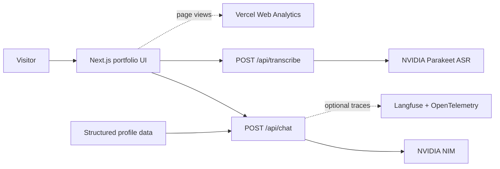

# Jeethesh Reddy — Portfolio

An interactive portfolio for a Software / AI Engineer building distributed systems, grounded AI products, and reliable developer platforms.


## Overview

This portfolio brings my work, experience, and engineering approach together in one interactive experience. It combines a guided career narrative, expandable project case studies, and **Ask Jeethesh**—a streaming assistant that answers questions using structured profile data.

The application also supports voice input through NVIDIA Parakeet ASR, Langfuse tracing, Vercel Web Analytics, responsive motion, keyboard navigation, theme preferences, and ambient audio controls.

## Highlights

- **Grounded portfolio assistant** — streams first-person answers constrained to the experience, projects, skills, and contact details in `src/data/profile.ts`.
- **Voice input** — records audio in the browser, normalizes it for transcription, and sends it to NVIDIA Parakeet ASR.
- **Privacy-aware observability** — groups chat turns into Langfuse sessions while masking secrets and contact details, limiting trace text, and excluding full conversation history from model telemetry.
- **Production safeguards** — validates chat and audio requests, enforces request limits, caps audio uploads at 12 MB, and returns explicit offline states when AI services are unavailable.
- **Interactive presentation** — includes expandable project cards, animated project connectors, smooth scrolling, a command palette, light and dark themes, and reduced-motion support.
- **Deployment visibility** — uses Vercel Web Analytics for production traffic insights.


## Architecture




### Chat flow

1. The client sends the conversation and an opaque chat-session ID to `POST /api/chat`.
2. The Route Handler validates configuration, request shape, and the client rate limit.
3. `buildSystemPrompt()` creates a first-person system prompt from `src/data/profile.ts`.
4. NVIDIA NIM generates the answer and the server streams it back to the client.
5. When Langfuse is configured, the route records a sanitized chat-turn trace and flushes it after the stream closes.


### Voice flow

1. Voice mode records microphone input in the browser.
2. The client prepares a transcription-compatible audio payload.
3. `POST /api/transcribe` validates the file type and 12 MB size limit.
4. NVIDIA Parakeet ASR returns text that the user can review before sending through the normal chat flow.


## Technology


| Area          | Technologies                                                        |
| ------------- | ------------------------------------------------------------------- |
| Application   | Next.js 16 App Router, React 19, TypeScript, Tailwind CSS 4         |
| AI            | AI SDK 7, OpenAI-compatible NVIDIA NIM adapter, NVIDIA Parakeet ASR |
| Observability | Langfuse, OpenTelemetry, Vercel Web Analytics                       |
| Interaction   | Motion, Lenis, Lucide React                                         |
| Content       | React Markdown, Remark GFM, structured TypeScript profile data      |
| Quality       | Vitest, ESLint, TypeScript strict mode                              |
| Hosting       | Vercel with Git-based preview and production deployments            |


## Getting started


### Prerequisites

- Node.js 24.x
- npm
- An [NVIDIA API key](https://build.nvidia.com/) for chat and voice features
- Optional Langfuse project keys for tracing


### Installation

```bash
git clone git@github.com:vectorvoyager358/Portfolio.git
cd Portfolio
npm install
cp .env.example .env.local
```

Configure at least the NVIDIA key in `.env.local`:

```bash
NVIDIA_API_KEY=nvapi-your-key-here
NVIDIA_MODEL=z-ai/glm-5.2
```

Start the development server:

```bash
npm run dev
```

Open [http://localhost:3000](http://localhost:3000).

Without `NVIDIA_API_KEY`, the portfolio UI still loads, but chat and transcription report an offline state and their Route Handlers return `503`.

## Environment variables


| Variable                       | Required            | Purpose                                                                                       |
| ------------------------------ | ------------------- | --------------------------------------------------------------------------------------------- |
| `NVIDIA_API_KEY`               | Yes for AI features | Server-side credential used by NVIDIA NIM and NVIDIA speech-to-text.                          |
| `NVIDIA_MODEL`                 | No                  | Chat model ID. Defaults to `z-ai/glm-5.2`.                                                    |
| `NVIDIA_ASR_URL`               | No                  | Overrides the built-in NVIDIA Parakeet transcription endpoint.                                |
| `LANGFUSE_PUBLIC_KEY`          | No                  | Langfuse project public key. Tracing requires both project keys.                              |
| `LANGFUSE_SECRET_KEY`          | No                  | Langfuse project secret key. Keep this server-side.                                           |
| `LANGFUSE_BASE_URL`            | No                  | Langfuse region URL, such as `https://us.cloud.langfuse.com` or `https://cloud.langfuse.com`. |
| `LANGFUSE_TRACING_ENVIRONMENT` | No                  | Trace environment label. Falls back to `VERCEL_ENV`, then `NODE_ENV`.                         |
| `LANGFUSE_TRACING_RELEASE`     | No                  | Optional release label. Production falls back to the Vercel Git commit SHA when available.    |


Tracing is disabled unless both Langfuse project keys are present. Failure to initialize or export tracing does not make the assistant unavailable.

## Route Handlers


| Route             | Methods       | Behavior                                                                      |
| ----------------- | ------------- | ----------------------------------------------------------------------------- |
| `/api/chat`       | `GET`, `HEAD` | Reports whether the NVIDIA chat integration is configured.                    |
| `/api/chat`       | `POST`        | Validates messages, applies rate limiting, and streams a grounded response.   |
| `/api/transcribe` | `GET`         | Reports whether speech-to-text is configured.                                 |
| `/api/transcribe` | `POST`        | Accepts supported audio form data up to 12 MB and returns transcription text. |


The default limits are 20 chat requests and 12 transcription requests per client per minute. These counters are stored in memory and are therefore best-effort and local to each runtime instance. A shared data store is required for globally consistent limits across multiple instances.

## Privacy and tracing

- The assistant does not require an account and does not ask for personal information.
- Voice audio is processed for the current transcription request and is not permanently stored by this application.
- Langfuse receives only the latest user question and final assistant answer after redaction and length limiting.
- Common API keys, bearer tokens, emails, phone numbers, and serialized secret fields are masked before trace export.
- Full prompts and conversation history are excluded from AI telemetry.
- Browser `localStorage` is used only for theme and ambient-music preferences.

See the live [privacy policy](https://portfolio-three-bice-shl0bnb8va.vercel.app/privacy) for the user-facing disclosure.

## Project structure

```text
src/
├── app/
│   ├── api/chat/route.ts         # Grounded streaming chat
│   ├── api/transcribe/route.ts   # NVIDIA speech-to-text
│   └── privacy/                  # Privacy policy page
├── components/
│   ├── chat/                     # Chat, voice mode, and voice orb
│   ├── work/                     # Expandable project presentation
│   └── providers/                # Music and application providers
├── data/
│   ├── profile.ts                # Grounding source of truth
│   └── privacy.ts                # Privacy-policy content
├── lib/
│   ├── langfuse.ts               # Trace sanitization and session helpers
│   ├── langfuse.server.ts        # OpenTelemetry registration and flushing
│   ├── nvidia.ts                 # NVIDIA chat provider
│   ├── asr.ts                    # NVIDIA transcription client
│   └── rate-limit.ts             # In-memory abuse protection
└── instrumentation.ts            # Server-side tracing bootstrap
```


## Scripts


| Command             | Purpose                                |
| ------------------- | -------------------------------------- |
| `npm run dev`       | Start the Next.js development server.  |
| `npm run build`     | Create an optimized production build.  |
| `npm run start`     | Serve the production build.            |
| `npm run lint`      | Run ESLint.                            |
| `npm run typecheck` | Run TypeScript without emitting files. |
| `npm test`          | Run the Vitest suite once.             |


## Deployment

The portfolio is deployed through the Vercel Git integration. The frontend and both Route Handlers are deployed together; a separate backend service is not required.

1. Import this repository in Vercel.
2. Set `main` as the production branch.
3. Add the NVIDIA variables to Preview and Production.
4. Add Langfuse variables when tracing is desired, using distinct `preview` and `production` environment labels.
5. Deploy once. Future pushes to `main` create production deployments, while pull requests and other branches create preview deployments.

Vercel Web Analytics is mounted in the root layout and requires no public client-side environment variable. Because chat and transcription use server Route Handlers, this application must run on a Next.js-compatible server platform and cannot be deployed as a purely static export.

Do not run a second `vercel deploy` workflow while the Git integration is active. Doing so would create duplicate deployments for the same commit. No `VERCEL_TOKEN`, `VERCEL_ORG_ID`, or `VERCEL_PROJECT_ID` GitHub secrets are required for the Git-integration workflow.

## Featured projects

- [Resilience Hub](https://github.com/vectorvoyager358/resilience-hub) — citation-grounded RAG with evaluation gates
- [VoxWire](https://github.com/vectorvoyager358/voxwire) — low-latency voice AI over WebSockets
- [Local LLM Inference Benchmarking](https://github.com/vectorvoyager358/Local-LLM-Inference-Benchmarking-System) — empirical SLM performance testing on constrained hardware
- [Moment Keeper](https://github.com/vectorvoyager358/moment-keeper) — a product for preserving and revisiting meaningful memories
- [Portfolio](https://github.com/vectorvoyager358/Portfolio) — this interactive AI portfolio


## License

Released under the [MIT License](LICENSE).